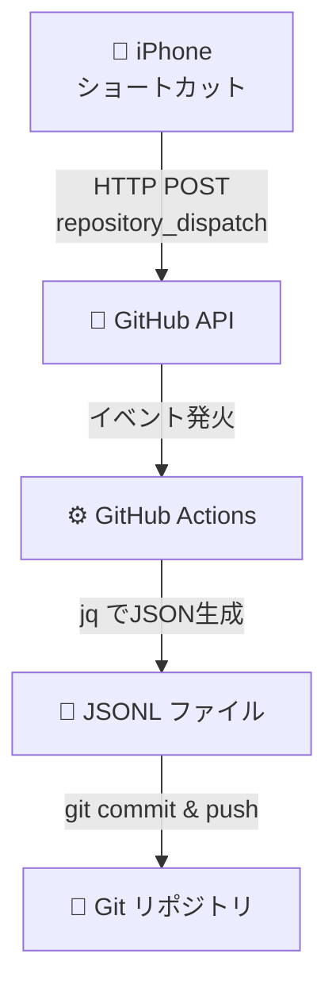

:::message
- iPhoneショートカットからGitHub APIを叩き、GitHub ActionsでJSONL形式のライフログを自動記録するシステムを構築した
- メンタル・食事・運動・体重・呼吸の5種類を同一アーキテクチャで実装し、8ヶ月にわたり5,300件超を記録した
- プレーンテキスト（JSONL）で蓄積することで、LLM分析基盤としても機能して楽しい
:::

## はじめに

ライフログで人生のすべてを記録したいと思ったことはありませんか？私はあります。

調べてみたところ、ライフログの手段はすでにいくつか存在するようです。[iPhoneショートカット × Notion](https://sizu.me/watayu0828/posts/4iwti6d8ez3r)の組み合わせは手軽ですが、データはNotionのサーバーに依存してしまいます。[FxLifeSheet](https://github.com/KrauseFx/FxLifeSheet)のようにTelegramボット + PostgreSQLで本格的なQuantified Selfを実践する方法もありますが、サーバー運用が必要になります。プレーンテキストで記録する文化としては[Nomie](https://nomie.app/)のようなオープンソースのライフトラッカーもありましたが、2023年2月にサービスを終了してしまいました。

また、iPhoneとGitHub Actionsを組み合わせる事例として、[Apple Shortcutからworkflow_dispatchを叩く方法](https://island94.org/2024/01/trigger-github-actions-workflows-from-apple-shortcuts)や、[iPhoneショートカットからGitHub Issueにコメントを投稿し、GitHub Actionsでマークダウンファイルに変換する方法](https://qiita.com/TaigoKuriyama/items/32f3ef128db2b9344e6a)があることも知られています。

上記と比較した本記事の特徴は、 **構造化データ（JSONL）をGitリポジトリに直接蓄積する** 点にあります。Issueコメントやマークダウンではなく、1行1レコードのJSONLで記録することで、`jq`やPythonでの機械的な加工が容易になります。自前のサーバーは不要で、GitHub Actions無料枠だけで運用できます。そしてJSONLはLLMが最も扱いやすいフォーマットの一つであり、蓄積したデータをそのままLLMに渡して分析させることもできます。記事の後半ではその具体例も紹介します。


*ホーム画面のアイコンをタップしてからログ記録が完了するまでの流れ*

## システム全体像



1. **iPhoneショートカット**がスコアやメモを入力し、GitHub APIにPOSTする
2. **GitHub API**が`repository_dispatch`イベントを発火する
3. **GitHub Actions**がワークフローを実行し、`jq`でJSONを生成する
4. 生成したJSONを**JSONLファイルに追記**し、`git commit & push`する

### `repository_dispatch` の選定理由

GitHub Actionsのワークフローをトリガーする方法はいくつかありますが、iPhoneショートカットから直接叩くには`repository_dispatch`が適切と判断しました。

| トリガー | 特徴 | iPhoneから利用 |
|---------|------|---------------|
| `workflow_dispatch` | GitHub UIやCLIから手動実行。`inputs`をYAMLで事前定義する必要がある（個数・型に制約あり） | ○（PATで可能だが、workflow IDの指定が必要） |
| `repository_dispatch` | 任意のHTTP POSTで発火。`client_payload`で自由にデータ送信 | **◎** |

どちらもPATによるHTTP POSTで発火できますが、`repository_dispatch`は`client_payload`に任意のJSONを載せられるため、iPhoneショートカットの「URLの内容を取得」アクションとの相性が良さそうと考えました。

### 無料枠で十分

GitHub Actionsの無料枠はパブリックリポジトリなら無制限、プライベートリポジトリでも **月2,000分** あります。1回のワークフロー実行は約20〜30秒なので、1日に数十回記録しても月の無料枠を使い切ることはまずありません。実際、8ヶ月の運用期間中、一度も無料枠を使い切ることはありませんでした。

## メンタルログの実装

ここからは、メンタルログ（そのときの気持ちの記録）を例に具体的な実装を解説します。

### GitHub Actions ワークフロー

`.github/workflows/mental_log.yml` の全体像を示します。

```yaml
# ワークフローの名前
name: Add Mental Health Log

# 同時実行制御（リポジトリレベルでの競合を防ぐ）
concurrency:
  group: repo-write-${{ github.repository }}
  cancel-in-progress: false

# ワークフローが起動するきっかけ
on:
  repository_dispatch:
    # "add_mental_log" が送られてきたら起動
    types: [add_mental_log]

# 実行されるタスク
jobs:
  create_log_file:
    runs-on: ubuntu-latest
    steps:
      # ①リポジトリのファイルにアクセスする準備
      - name: Checkout repository
        uses: actions/checkout@v4
        with:
          # リポジトリに書き込む（pushする）権限を持つPATを指定する
          token: ${{ secrets.ACCESS_TOKEN }}

      # ②ログファイルを作成し、コミットする処理
      - name: Append Log to JSONL File
        # env: キーで環境変数を設定（文字化け防止 & iPhoneからの情報受取）
        env:
          LANG: C.UTF-8
          SCORE_RAW: ${{ github.event.client_payload.score }}
          MEMO: ${{ github.event.client_payload.memo }}
          LATITUDE: ${{ github.event.client_payload.latitude }}
          LONGITUDE: ${{ github.event.client_payload.longitude }}
          ADDRESS_RAW: ${{ github.event.client_payload.address }}
        run: |
          # --- 1. タイムスタンプとファイルパスの準備 ---
          JST_ISO_TIMESTAMP=$(TZ=Asia/Tokyo date --iso-8601=seconds)
          JST_DATE_YMD=$(TZ=Asia/Tokyo date +'%Y-%m-%d')
          JST_DATE_YM=$(TZ=Asia/Tokyo date +'%Y-%m')
          FILE_PATH="sync/Mental/${JST_DATE_YM}/${JST_DATE_YMD}-mental.jsonl"
          mkdir -p "$(dirname "${FILE_PATH}")"

          # --- 2. データの整形 ---
          # 住所から改行コードを削除
          ADDRESS=$(echo "${ADDRESS_RAW}" | tr -d '\n\r')
          # スコアから数値のみを抽出 (例: "4:好調😁" -> "4")
          SCORE_NUMBER=$(echo "${SCORE_RAW}" | cut -d ':' -f 1)

          # --- 3. jqを使って安全にJSONオブジェクトを生成 ---
          JSON_LINE=$(jq -c -n \
            --arg timestamp "${JST_ISO_TIMESTAMP}" \
            --argjson score "${SCORE_NUMBER:-null}" \
            --arg memo "${MEMO}" \
            --argjson latitude "${LATITUDE:-null}" \
            --argjson longitude "${LONGITUDE:-null}" \
            --arg address "${ADDRESS}" \
            '{timestamp: $timestamp, score: $score, memo: $memo, location: {latitude: $latitude, longitude: $longitude, address: $address}}')

          # --- 4. ファイルの末尾に追記 ---
          echo "${JSON_LINE}" >> "${FILE_PATH}"

          # --- 5. Gitへのコミットとプッシュ ---
          git config --global user.name 'github-actions[bot]'
          git config --global user.email 'github-actions[bot]@users.noreply.github.com'
          git add "${FILE_PATH}"
          git commit -m "🧠 Add mental log at $(TZ=Asia/Tokyo date +'%H:%M:%S')"

          # リモートの最新状態を取得してからpush（競合回避）
          git pull --rebase origin master || true
          git push
```

以下、ポイントとなる箇所を順に解説します。

#### ステップ1: タイムスタンプとファイルパス

```bash
JST_ISO_TIMESTAMP=$(TZ=Asia/Tokyo date --iso-8601=seconds)
JST_DATE_YMD=$(TZ=Asia/Tokyo date +'%Y-%m-%d')
JST_DATE_YM=$(TZ=Asia/Tokyo date +'%Y-%m')
FILE_PATH="sync/Mental/${JST_DATE_YM}/${JST_DATE_YMD}-mental.jsonl"
```

GitHub ActionsのランナーはUTCで動いているため、`TZ=Asia/Tokyo`を明示してJSTのタイムスタンプを生成します。ファイルパスは`sync/Mental/2026-01/2026-01-15-mental.jsonl`のように **日ごと** に分割しています。この理由は後述します。

#### ステップ2: データの整形

```bash
ADDRESS=$(echo "${ADDRESS_RAW}" | tr -d '\n\r')
SCORE_NUMBER=$(echo "${SCORE_RAW}" | cut -d ':' -f 1)
```

iPhoneの「現在地を取得」が返す住所には改行が含まれることがあるため、`tr -d '\n\r'`で除去しています。スコアは後述するショートカットの「リストから選択」で`"4:好調😁"`のような形式で送られてくるので、`cut -d ':' -f 1`で数値部分だけを抽出します。

#### ステップ3: jqによるJSON生成

```bash
JSON_LINE=$(jq -c -n \
  --arg timestamp "${JST_ISO_TIMESTAMP}" \
  --argjson score "${SCORE_NUMBER:-null}" \
  --arg memo "${MEMO}" \
  --argjson latitude "${LATITUDE:-null}" \
  --argjson longitude "${LONGITUDE:-null}" \
  --arg address "${ADDRESS}" \
  '{timestamp: $timestamp, score: $score, memo: $memo, location: {latitude: $latitude, longitude: $longitude, address: $address}}')
```

詳しくは「技術ポイント深掘り」セクションで解説します。

#### ステップ4〜5: 追記とコミット

```bash
echo "${JSON_LINE}" >> "${FILE_PATH}"
```

`>>`で既存ファイルの末尾に1行追記します。これがJSONLフォーマットの利点で、ファイル全体を読み込んで書き戻す必要がありません。

### iPhoneショートカットの設定

iPhoneショートカット側の設定を解説します。

#### 事前準備: PATの発行

1. GitHubの **Settings > Developer settings > Personal access tokens > Fine-grained tokens** を開く
2. **Generate new token** をクリック
3. **Repository access** で対象リポジトリのみを選択
4. **Permissions** で **Contents: Read and write** を付与
5. トークンをコピーし、iPhoneのショートカットで使えるようにメモしておく

:::message
Classic tokens（`ghp_`で始まるもの）でも動作しますが、Fine-grained tokens を使うことでリポジトリ単位の権限制御ができるため、セキュリティ面で推奨します。
:::

#### ショートカットの構成

ショートカットは以下の4ステップで構成されます。


*ショートカットの概要*

**1. 「リストから選択」でスコアを入力**

以下のリストを作成し、ユーザーに選択させます。

```
5:最高😆
4:好調😁
3:普通😐
2:低調😣
1:最低😫
```

**2. 「テキストを要求」でメモを入力（任意）**

簡単な一言メモを入力します。空欄も許容します。

**3. 「現在地を取得」で位置情報を取得**

「現在地を取得」アクションを追加します。

**4. 「URLの内容を取得」でGitHub APIにPOST**

最後に、以下の設定で`repository_dispatch`イベントを発火します。

- **URL**: `https://api.github.com/repos/{owner}/{repo}/dispatches`
- **方法**: POST
- **ヘッダー**:
  - `Authorization`: `token {your_pat}`
  - `Accept`: `application/vnd.github.v3+json`
- **本文** (JSON):

```json
{
  "event_type": "add_mental_log",
  "client_payload": {
    "score": "（リストから選択の結果）",
    "memo": "（テキスト入力の結果）",
    "latitude": "（現在地の緯度）",
    "longitude": "（現在地の経度）",
    "address": "（現在地の住所）"
  }
}
```


:::message
PATはショートカットのテキスト変数にベタ書きすることになります。iPhoneのショートカットは端末内に保存されるため比較的安全ですが、それでもセキュリティ上のリスクとなり得ます。取り扱いは十分ご注意ください。
:::

#### ショートカットの動作


*ホーム画面のアイコンをタップしてからログ記録が完了するまでの流れ*

### 実際のJSONLレコード

記録されるデータは以下のようになります（サンプル）。

```jsonl
{"timestamp":"2026-01-15T08:30:12+09:00","score":4,"memo":"朝から天気が良い","location":{"latitude":35.6812,"longitude":139.7671,"address":"東京都千代田区丸の内1丁目"}}
{"timestamp":"2026-01-15T12:45:33+09:00","score":3,"memo":"昼食後、少し眠い","location":{"latitude":35.6812,"longitude":139.7671,"address":"東京都千代田区丸の内1丁目"}}
{"timestamp":"2026-01-15T18:20:05+09:00","score":5,"memo":"プロジェクトが一区切りついた","location":{"latitude":35.6580,"longitude":139.7016,"address":"東京都渋谷区道玄坂1丁目"}}
```

1行1レコードのJSONL形式なので、`cat`や`jq`でそのまま加工できます。

## 技術ポイント深掘り

### jqによるJSON生成

シェルスクリプトでJSONを生成する際、よくある危険なパターンがこちらです。

```bash
# 危険: メモに " が含まれるとJSONが壊れる
echo "{\"score\": ${SCORE}, \"memo\": \"${MEMO}\"}" >> file.jsonl
```

ユーザー入力（メモ）にダブルクォートやバックスラッシュが含まれると、JSONとして不正な文字列が生成されます。例えばメモに `"` が含まれるとJSONの構造自体が壊れ、意図しないフィールドが注入される可能性があります。

`jq`を使えば、この問題を回避できます。

```bash
# 安全: jqが自動でエスケープしてくれる
JSON_LINE=$(jq -c -n \
  --arg memo "${MEMO}" \
  '{memo: $memo}')
```

#### `--arg` と `--argjson` の使い分け

| オプション | 入力の型 | jq変数の型 | 用途 |
|-----------|---------|-----------|------|
| `--arg` | 文字列 | 文字列 | メモ、住所など |
| `--argjson` | JSON値 | そのまま | 数値、null、真偽値 |

```bash
# --arg: 値は常に文字列になる
--arg memo "${MEMO}"           # → "memo": "テスト"

# --argjson: 値はJSONとして解釈される
--argjson score "${SCORE:-null}" # → "score": 4  または "score": null
```

#### `${VAR:-null}` のフォールバック

iPhoneから値が送られなかった場合、環境変数は空文字になります。`--argjson`に空文字を渡すとjqがエラーを出すため、`${VAR:-null}`でフォールバックさせます。

```bash
--argjson latitude "${LATITUDE:-null}"
# LATITUDE=""の場合 → --argjson latitude "null" → "latitude": null
```

### スコア文字列のパース

iPhoneの「リストから選択」は、選択された項目をそのまま文字列として返します。つまり`"4:好調😁"`という文字列がそのまま`client_payload`に載ります。

```bash
# "4:好調😁" → "4"
SCORE_NUMBER=$(echo "${SCORE_RAW}" | cut -d ':' -f 1)
```

`cut -d ':' -f 1`でコロンの前の数値だけを取り出すシンプルな実装を採用しました。

### 並行書き込みの競合対策

1日に20回以上記録していると、ときに二つのワークフローが同時に走り、`git push`が競合することがあります。これを防ぐ仕組みを二つ設けました。

**1. `concurrency`グループ**

```yaml
concurrency:
  group: repo-write-${{ github.repository }}
  cancel-in-progress: false
```

同じ`group`のワークフローは同時に実行されません。ただし、**キューの深さは1**（実行中1 + 待機中1）である点に注意が必要です。短時間に3件以上のリクエストが集中すると、待機中のワークフローが新しいものに置き換えられ、中間のログが失われる可能性があります。`cancel-in-progress: false`を設定することで、実行中のジョブがキャンセルされることは防げます。実用上は、記録の間隔が1分以上空いていればこの問題に遭遇することはほぼありません。

**2. `git pull --rebase`**

```bash
git pull --rebase origin master || true
git push
```

万が一のフォールバックです。push前にrebaseすることで、直前に別のコミットが入っていても取り込んでからpushできます。`|| true`はrebase中にコンフリクトが発生した場合などにワークフロー全体が失敗するのを防ぐためです。

### ファイル分割戦略

JSONLファイルをどう分割するかは、**1日あたりの記録数**で判断しました。

| 分割単位 | 適するケース | 例 |
|---------|------------|---|
| **日次** (`YYYY-MM-DD-xxx.jsonl`) | 1日に複数回記録 | メンタル（~22件/日）、食事（~13件/日） |
| **月次** (`YYYY-MM-xxx.jsonl`) | 1日0〜1回程度 | 運動、体重、呼吸 |

高頻度のログを月次ファイルにまとめると、1ファイルが数百行になりgit diffが見づらくなります。逆に低頻度のログを日次で分割すると、ほぼ空のファイルが大量にできてしまいます。

## 応用: 他のログへの拡張

同じアーキテクチャで、フィールドとファイルパスを変えるだけで様々なログに対応できます。実際に運用しているログの一部を紹介します。

| ログ種別 | event_type | ファイル分割 | 固有フィールド |
|---------|-----------|------------|--------------|
| メンタル | `add_mental_log` | 日次 | `score` |
| 食事 | `add_food_log` | 日次 | `item`, `score`, `quantity`, `unit` |
| 運動 | `add_exercise_log` | 月次 | `activity_type`, `effort_quantity`, `effort_unit`, `score` |
| 体重 | `add_weight_log` | 月次 | `weight_kg` + Pixela連携 |
| 呼吸 | `add_breath_log` | 日次 | `breath_count` + Pixela連携 |

### 食事ログ

メンタルログとの主な違いはフィールドの拡張です。`item`（食べたもの）、`quantity`（量）、`unit`（単位）が加わります。

```yaml
# jq部分の抜粋
JSON_LINE=$(jq -c -n \
  --arg timestamp "${JST_ISO_TIMESTAMP}" \
  --arg item "${ITEM}" \
  --argjson score "${SCORE_NUMBER:-null}" \
  --arg quantity "${QUANTITY}" \
  --arg unit "${UNIT}" \
  --arg memo "${MEMO}" \
  --argjson latitude "${LATITUDE:-null}" \
  --argjson longitude "${LONGITUDE:-null}" \
  --arg address "${ADDRESS}" \
  '{timestamp: $timestamp, item: $item, score: $score, quantity: $quantity, unit: $unit, memo: $memo, location: {latitude: $latitude, longitude: $longitude, address: $address}}')
```

iPhoneショートカット側では「テキストを要求」で食べたものを入力し、「リストから選択」でスコアを付ける構成になります。

### 運動ログ

運動ログは記録頻度が低いため、**月次ファイル**にまとめています。

```yaml
# ファイルパスの違い
FILE_PATH="sync/Exercise/${JST_DATE_YM}-exercise.jsonl"
```

また、スコアのデフォルト値を`3`（普通）に設定しています。運動は「やった」こと自体に意味があるため、毎回細かくスコアを付けなくても記録できるようにしています。

```yaml
--argjson score "${SCORE_NUMBER:-3}"
```

### 体重ログ・呼吸ログ: Pixela連携

体重と呼吸のログでは、JSONLへの記録に加えて[Pixela](https://pixe.la/)にもデータを送信しています。Pixelaは草グラフ（GitHubのコントリビューショングラフのようなもの）を生成できるサービスで、記録のモチベーション維持に役立ちます。とても良いものです。

```yaml
# 体重ログでのPixela連携部分（抜粋）
TARGET_WEIGHT=$(jq -r '.target_weight' sync/Weight/config.json)
HEALTH_VALUE=$(echo "${WEIGHT} ${TARGET_WEIGHT}" | awk '{ printf "%.1f", $1 - $2 }')
curl -s -X PUT "https://pixe.la/v1/users/${PIXELA_USERNAME}/graphs/health-score/${JST_DATE_PIXELA}" \
     -H "X-USER-TOKEN:${PIXELA_USER_TOKEN}" \
     -d "{\"quantity\":\"${HEALTH_VALUE}\"}"
```

目標体重との差分を計算してPixelaに送ることで、目標への近づき具合を草グラフで可視化できます。Pixela連携の詳細は割愛しますが、要は`curl`でAPIを叩くだけです。とてもシンプルで使いやすいです。

## 溜まったデータを分析してみる

8ヶ月分のデータが溜まったので、簡単な分析をしてみました。JSONLはPythonの標準ライブラリだけで読み込めるため、分析のハードルは高くありません。

```python
import json
from pathlib import Path

entries = []
for path in sorted(Path("sync/Mental/").rglob("*.jsonl")):
    for line in path.read_text(encoding="utf-8").splitlines():
        if line.strip():
            entries.append(json.loads(line.strip()))
```

`Path.rglob("*.jsonl")`でサブディレクトリも含めて全ファイルを再帰的に取得します。

### 基本統計

| 指標 | 値 |
|------|-----|
| 記録期間 | 2025-07-15 〜 2026-03-12（241日間） |
| 総レコード数 | 5,314件 |
| 記録日数 | 241日（記録率: **100.0%**） |
| 1日あたり平均 | 22.0件 |
| スコア平均 | 4.13 |

記録率100%でした。iPhoneのホーム画面にショートカットを置いておくだけで、自然と記録する習慣が身についたようです。

### 全記録のストリップチャート

まずは全5,314件を俯瞰してみます。横軸が時間、縦軸がスコアで、1件1件の記録を縦線で描画しています。


*1件の記録を1本の縦線で表示。線の密度がそのまま記録頻度を表す*

スコア4〜5の線が圧倒的に密で、記録の大半を占めていることが一目でわかります。一方で、スコア2の線も一定の頻度で現れており、12月付近ではやや密度が高くなっています。

### 日次平均スコアの推移


*日次平均スコア（青点）と7日移動平均（赤線）の推移*

7日移動平均を見ると、概ね3.5〜4.5の範囲で推移しています。12月に一度大きく落ち込んでいますが、年末年始を挟んで回復している様子が見て取れます。こうした長期トレンドは、日々の記録だけでは気づきにくいものです。

### 時間帯 × 曜日の平均スコア


*横軸が時刻、縦軸が曜日。色が濃い緑ほど高スコア*

いくつかのパターンが読み取れます。

- **深夜〜早朝（2〜6時）はスコアが低い**: 特に金曜・土曜の深夜は2.7前後まで落ち込んでいます。たいていこの時間帯は繁忙のために無理をしている事が多いため、納得の結果です
- **夜間（21〜23時）はスコアが高い**: 曜日を問わず4.2〜4.5で安定しています。1日の終わりに穏やかな気持ちで記録できているようです
- **記録のない枠は深夜に集中**: 空白セルは主に2〜4時台に見られ、その時間帯はそもそも起きていない日が多いことを示しています

### 記録頻度カレンダー


*GitHubの草グラフのように、1日あたりの記録件数を色の濃さで表現*

241日間で途切れることなく記録が続いています。濃い緑の日は40〜50件以上記録しており、特に意識的に記録を増やした日のようです。

## LLMで分析する

Pythonで統計的な分析ができることは示しましたが、JSONLの真価はLLMとの組み合わせで発揮されます。JSONLは1行1レコードの構造化テキストなので、LLMのコンテキストウィンドウにそのまま流し込めます。

### ワンライナーで週次振り返り

最も手軽な方法は、`jq`でデータを整形してCLIのLLMに渡すことです。

```bash
# 今週のメンタルログをClaudeに渡して傾向を分析させる
cat sync/Mental/2026-03/2026-03-*.jsonl | \
  jq -s '[.[] | {timestamp, score, memo}]' | \
  claude -p "このメンタルログの1週間の傾向を分析し、
    改善提案を3つ挙げてください。
    スコアの時間帯パターンとメモの内容の両方に注目してください。"
```

`jq -s`で全行を配列にまとめ、位置情報を除いた軽量なJSONを生成してからLLMに渡しています。実際に12日分・約200件のメンタルログを渡した結果がこちらです。

:::details 実際の分析結果（クリックで展開）

> **スコアの時間帯パターン**
>
> | 時間帯 | 傾向 | 特徴的なメモ |
> |--------|------|-------------|
> | 5:00-8:00 | 3〜4中心、「眠い」多発 | 起床直後のスコア3が常態化 |
> | 8:00-12:00 | 4〜5、比較的安定 | 朝食・作業開始で上昇 |
> | 13:00-16:00 | **最大の谷**、2〜3に急落 | 「眠い」「眠すぎる」が集中 |
> | 16:00以降 | **一気に5へ回復** | 休憩を挟んでリセット |
> | 17:00-22:00 | 4〜5、最も安定して高い | 作業の達成感、家族との会話 |
>
> **改善提案**
>
> 1. **就寝時間の前倒し** — 0:00過ぎまで起きた翌朝は必ずスコア3の「眠い」から始まる。23:30を就寝リミットにするだけで、翌日の起床スコアが1〜2ポイント改善する可能性が高い
> 2. **午後に意識的な休憩を入れる** — 14:00前後の眠気は意志力で解決できていない（12日間でほぼ毎日発生）。最初から短い休憩を予定に組み込むことで、午後の生産性を底上げできる
> 3. **スコアを上げるトリガーの意識的な確保** — 家族との会話は最も安定したスコア5のトリガー。多忙時にも短い会話を1日1回意識的に入れることで、スコアの下限を底上げできる

*※個人を特定できる情報は編集しています*

:::

プロンプトを1行書くだけで、時間帯パターンの抽出からメモの内容分析、具体的な改善提案まで返ってきました。ハルシネーションがあるため裏取りは必須ですが、楽しいですね。

### さらに先へ: 自分専用のLLMエージェント

この仕組みをさらに発展させると、蓄積したライフログをコンテキストとして常に参照できる**自分専用のLLMエージェント**を構築できます。メンタルログだけでなく、食事・運動・体重のデータを横断的にLLMに渡すことで、「最近スコアが低い日は運動をしていない日と相関がある」「この食事パターンのときに体調が良い」といった、複数のログを横断した洞察が可能になります。

私は実際に、このライフログデータをベースにした自律型エージェントシステムを運用しています。その詳細は別記事で紹介予定です。

## 8ヶ月運用してわかったこと

### つらかったこと

**コミット数が膨大になる**

1レコードにつき1コミットが必要なので、単純計算で5,300件超のコミットがリポジトリに積み上がっています。本質的な問題ではありませんが、`git log`が実質的にライフログのタイムラインと化しており、通常の開発用途とは混ぜられません。ライフログ専用リポジトリとして割り切る必要があります。

**意外と衝突する**

前述したように、concurrencyのキューの深さは1（実行中1 + 待機中1）です。そのため、短時間に3件以上のリクエストが集中すると、中間のログが失われる可能性があります。記録の間隔を1分以上空ければ問題ありませんが、気持ちが高ぶっているときほど複数のログを連続入力したくなるのが皮肉です。

**iPhoneが手放せなくなる**

これが一番つらいかもしれません。感情の機微を捉えようとするあまり、常にiPhoneを手元に置くクセがつき、**間接的にスクリーンタイムが増えました**。理想的にはIoTデバイス（物理ボタンなど）でメンタルログだけを記録できる仕組みがあれば、スマホ依存を避けつつ記録を続けられるはずです。これは今後の課題です。

**プライベートリポジトリでも不安は残る**

位置情報付きのメンタルデータという極めてセンシティブな情報を、プライベートリポジトリとはいえGitHubに預けている事実は意識しておくべきです。GitHubの利用規約上、プライベートリポジトリの内容にGitHubがアクセスする可能性はゼロではありません。本当に機密性の高いデータを扱う場合は、自前のGitサーバーやローカルリポジトリへの移行も検討すべきでしょう。

### よかったこと

**日常の細かな瞬間に感謝できるようになる**

スコアを付ける行為そのものが、自分の状態を内省するきっかけになりました。「天気がいい」「なんとなく体調がいい」といった、普段なら見過ごしてしまう小さな幸運に気づけるようになりました。

**良い暇つぶしになる**

通勤時間や、Claude Codeがコーディングしている待ち時間など、手持ち無沙汰になりがちな時間をメンタルログの記録に充てることで、「何もしていない時間」が「自分を振り返る時間」に変わりました。

**外に出かけたくなる**

位置情報も記録しているため、色んな場所で記録を残したくなりました。そういえば、ちょっとした散歩に出かける頻度が増えた気がします。また、私は通勤を親の敵のごとく憎んでおりましたが、このシステムを構築したあとは少しだけ前向きに捉えられるようになりました。

**LLMとの相性が非常に良い**

前述の通り、蓄積したJSONLデータはLLMのコンテキストとしてそのまま活用できます。ワンライナーでの分析から自律型エージェントの構築まで、データがプレーンテキストであるからこそ広がる可能性が、このシステムの最大の副産物かもしれません。

## まとめ

本記事では、iPhoneショートカットとGitHub Actionsを組み合わせたライフログシステムを紹介しました。

iPhoneとGitHubアカウントがあれば、今日から始められます。ご興味のある方はぜひご検討ください。

## 参考リンク

### iPhoneショートカット × GitHub Actions

- [Trigger GitHub Actions workflows with inputs from Apple Shortcuts - Island94.org](https://island94.org/2024/01/trigger-github-actions-workflows-from-apple-shortcuts) — Apple ShortcutでGitHub Actionsを起動し、ファイル生成からgit commitまで自動化する事例。本記事のアーキテクチャに最も近い
- [GitHub Actions + Shortcuts for iOS - Jon Kulton](https://jkulton.com/2022/github-actions-shortcuts-for-ios/) — `workflow_dispatch`をiOSショートカットのHTTPリクエストで叩く方法の解説
- [How to dispatch a GitHub Workflow from iOS Shortcuts - The Porteur](https://www.theporteur.com/journal/dispatch-github-action-ios-shortcuts) — GitHub Mobileの「Dispatch Workflow」アクションを使う手順
- [GitHub と Claude Code でタスク管理・日記・個人ナレッジを管理する - Qiita](https://qiita.com/TaigoKuriyama/items/32f3ef128db2b9344e6a) — iPhoneショートカットからGitHub Issueにコメントを投稿し、GitHub Actionsでマークダウンファイルに変換する事例

### Quantified Self / ライフログ

- [FxLifeSheet - Felix Krause](https://github.com/KrauseFx/FxLifeSheet) — Telegramボット経由で1日75項目のライフデータを手動入力し、PostgreSQLに蓄積するプロジェクト
- [iPhoneショートカット × Notion活用術](https://sizu.me/watayu0828/posts/4iwti6d8ez3r) — iOSショートカットでヘルスケアデータをNotionに記録する事例
- [Nomie](https://nomie.app/) — `#mood(4) #pizza`のようなハッシュタグ記法でライフログを記録するオープンソースのトラッカー。2023年2月にサービス終了、[コードは公開済み](https://github.com/open-nomie/nomie6-oss)

### Pixela

- [peaceiris/actions-pixela](https://github.com/peaceiris/actions-pixela) — GitHub ActionsからPixelaに草を生やすAction
- [commit以外の数値でも草を生やせるPixela - a-know](https://blog.a-know.me/entry/2018/10/14/212338) — Pixela作者による紹介記事
